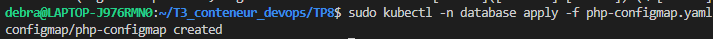
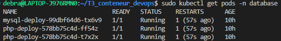

### TP2 — ConfigMap pour phpMyAdmin

Fichier php-configmap.yaml :
``` yaml
apiVersion: v1
kind: ConfigMap
metadata:
  name: php-configmap

data: 
  pma_arbitrary: "1"
```

Nouveau fichier php-deployment.yaml :

```yaml
apiVersion: apps/v1
kind: Deployment
metadata:
  name: php-deploy

spec:
  replicas: 2 # 2 noeuds PhpMyAdmin à créer et à maintenir au minimum
  selector: 
    matchLabels: 
      app: php
  
  template: 

    metadata:
      labels:
        app: php

    spec:
      containers:
        - name: php 
          image: phpmyadmin:latest 
          ports:
            - containerPort: 3306 
          
          env:
          - name: PMA_ARBITRARY
            valueFrom:
              configMapKeyRef: # Utilisation du fichier configmap
                name: php-configmap
                key: pma_arbitrary # Nom de la clé qui contient la valeur "1"

```

Capture d'écran du configmap : 


Capture d'écran des pod php-deploy-... fonctionnels : 
