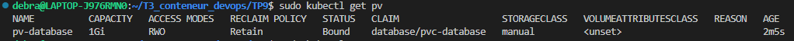
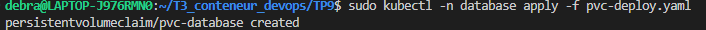

### TP9 - Persistance MySQL

Nouveaux fichiers pour créer le pv et le pvc : 
```yaml
apiVersion: v1
kind: PersistentVolume
metadata: 
  name: pv-database

spec:
  capacity:
    storage: 1Gi
  volumeMode: Filesystem
  accessModes:
    - ReadWriteOnce
  persistentVolumeReclaimPolicy: Retain
  storageClassName: manual
  hostPath:
    path: /mnt/data
```

```yaml
apiVersion: v1
kind: PersistentVolumeClaim
metadata: 
  name: pvc-database
spec:
  accessModes:
    - ReadWriteOnce
  resources: 
    requests:
      storage: 1Gi
  storageClassName: manual
```

Apply des fichier deploy : 

