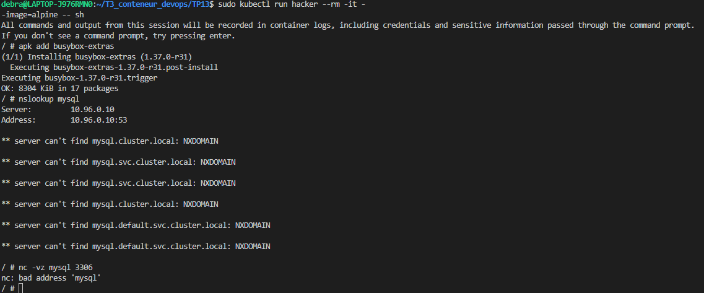

### TP13 NetworkPolicy : les 3 policies obligatoires

Voici les 3 fichiers de policy : 

* Fichier "deny-all-policiy", qui deny toutes requêtes non autorisées explicitements par une autre policy : 
```yaml
apiVersion: networking.k8s.io/v1
kind: NetworkPolicy
metadata:
  name: deny-all-policy
  namespace: database
spec:
  podSelector: {}
  policyTypes:
    - Ingress
    - Egress
```

* Fichier "allow-egress-pma.yaml" qui autorise le egress vers la db:
```yaml
apiVersion: networking.k8s.io/v1
kind: NetworkPolicy
metadata:
  name: allow-egress-pma
  namespace: database
spec:
  podSelector:
    matchLabels:
      app: php
  policyTypes:
    - Egress
  egress:
    - to:
      - podSelector:
          matchLabels:
            app: mysql
      ports:
        - protocol: TCP
          port: 3306
```

* Fichier "allow-ingress-mysql.yaml" qui autorise les requêtes entrantes vers la db
```yaml
apiVersion: networking.k8s.io/v1
kind: NetworkPolicy
metadata:
  name: allow-ingress-mysql
  namespace: database
spec:
  podSelector:
    matchLabels:
      app: mysql
  policyTypes:
    - Ingress
  ingress:
    - from:
        - podSelector:
            matchLabels:
              app: php
      ports:
        - protocol: TCP
          port: 3306
```

### Tests attendus : 

Résultats des commandes : 

