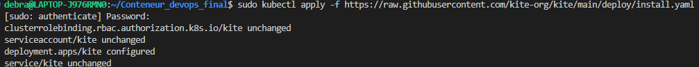
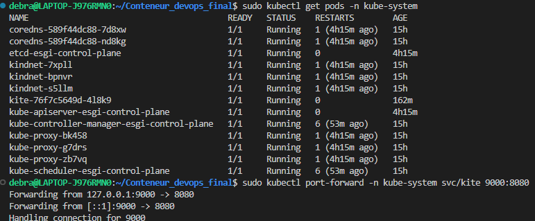
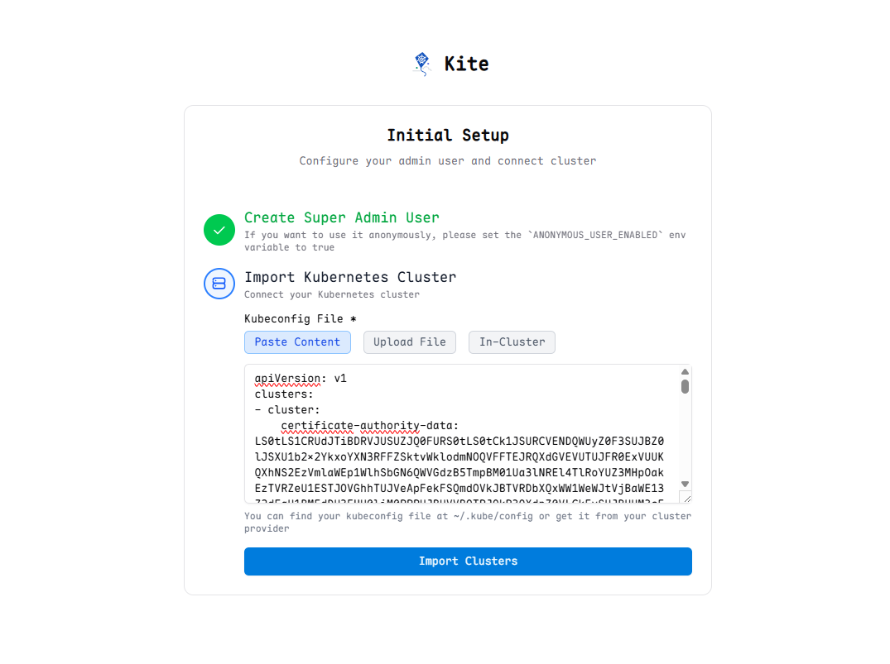
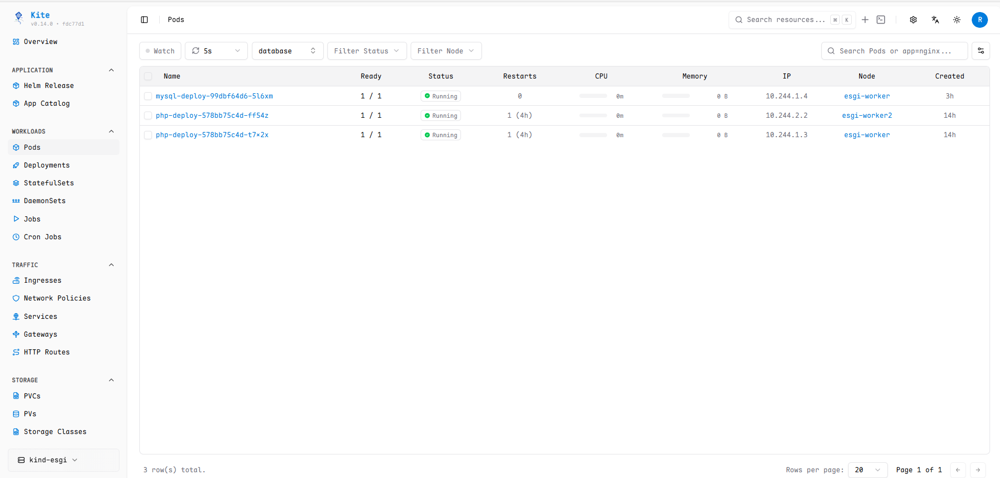

### TP7 — Kite (GUI cluster)

D'abord installation de kite : 

Puis, configuration d'un port-forward pour contacter le service kite et arriver sur le wizard de configuration : (PS: Je me suis trompé avec le type du cluster, mais j'ai bien rectifié et mis "In-Cluster") :

On peut voir les pods en running avec la GUI : 
